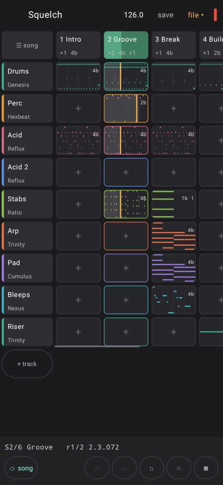
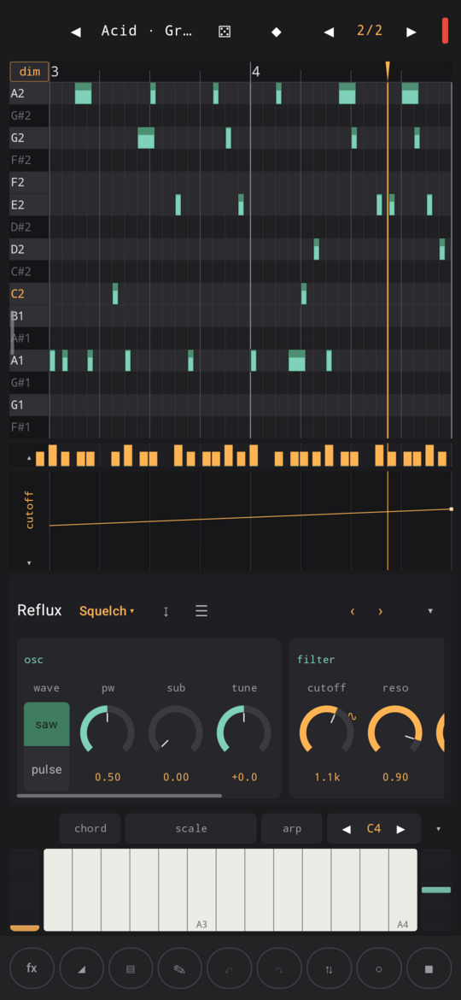
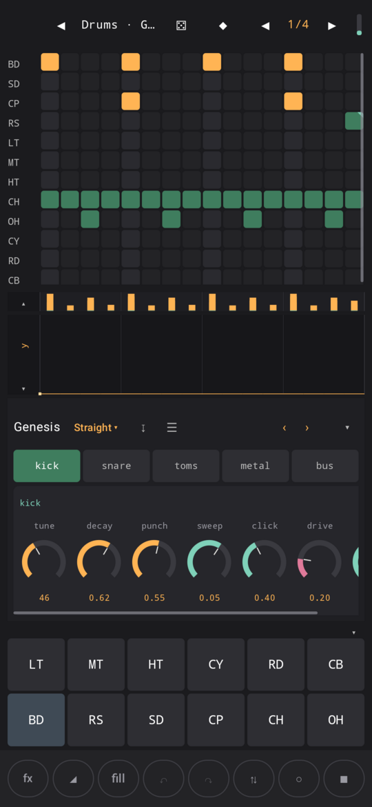
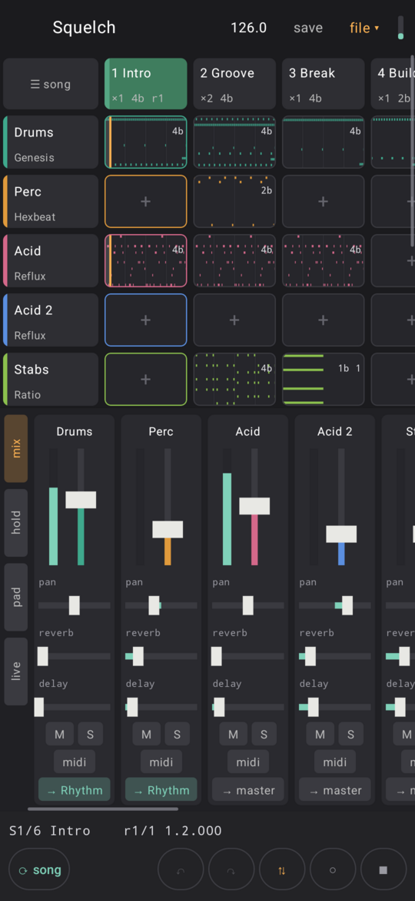
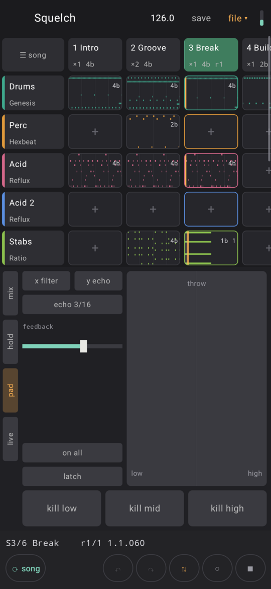
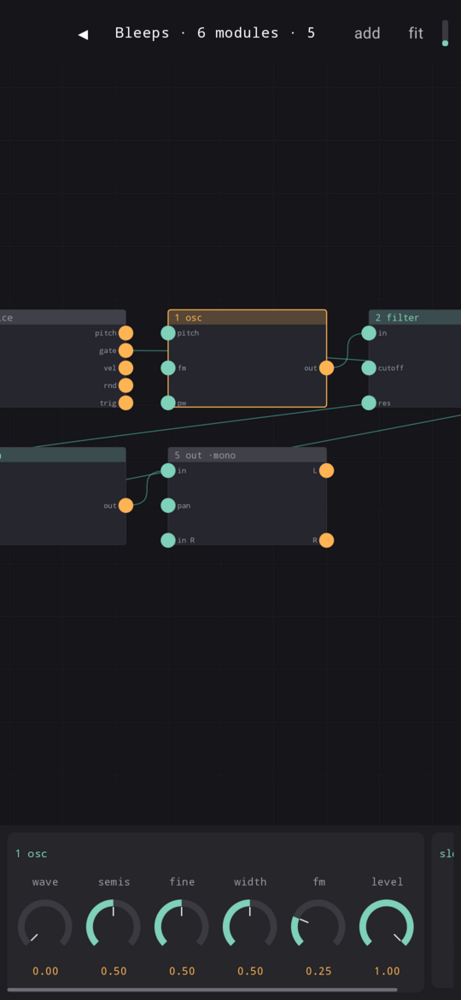

# Acidulous

Acidulous is a music studio for Android 8.1 and up. 

Combine up to 16 synthesizers, drum machines, noise generators and processors together
into scenes of music and play them in order or pick and choose to generate something new every time.

In many ways this is an homage to the wonderful musical creation tool Caustic, many of the machines
here are heavily inspired by Caustic and I have had it in mind through this whole process. I have also
been inspired by many other synths, drum machines, and sequencers but I have tried to put my own stamp
on every inspiration and bring some of my own.

Read below for more details on the machines, sequencer, and app capabilities. 

You can very much make music with this now, exporting via a number of formats in full form or split into stems.
Please do and then let me know what works, what doesn't work, what could work in the future so I can grow it into something even more interesting.

Please join me in the #acidulous channel **[on my discord](https://discord.gg/9Wun47jGC6)**  to share comments, ask questions, report bugs or issues with different devices, or to request new features. Or feel free to open an issue here.

The manual is in [manual/](manual/) and in the app in the **Help…** window.

Enjoy,<br>
Dan (rm)

---

## Screenshots

<table>
  <tr>
    <td align="center"><br>The song: tracks down, scenes across</td>
    <td align="center"><br>An acid line, with its filter drawn in</td>
    <td align="center"><br>Drums: steps, pads and the kit's knobs</td>
  </tr>
  <tr>
    <td align="center"><br>The mixer, with a drum group</td>
    <td align="center"><br>The perform pad: filter, echo and kills</td>
    <td align="center"><br>The modular, patched by hand</td>
  </tr>
</table>

All six are the demo song, Squelch.

---

## What's in it

### Twenty machines

| | |
|---|---|
| **Reflux** | The acid bass. One oscillator and a filter that screams. Accent comes from velocity and slide from overlapping notes, so you just play it. |
| **Trinity** | A three-oscillator poly synth with wavetables, stacked voices, FM between the oscillators and a bit of drift. |
| **Ratio** | Six-operator FM. You can morph between two algorithms and snap or skew the operator ratios. |
| **Manual** | An organ. Two manuals and pedals, four models (tonewheel, combo, reed, pipe) and a rotary cabinet. |
| **Cumulus** | Pads built from a spectrum of partials, like PadSynth. Big, smooth and slow to change. |
| **Formulate** | An 8-bit chip synth with tracker-style step tables, plus a small expression language so you can type your own waveform. |
| **Filament** | Physically modelled strings. Pluck, pick, hammer, bow or blow them. |
| **Brazen** | Modelled brass, from tuba to trumpet, or a section of four players. |
| **Timber** | Modelled woodwinds: clarinet, oboe, sax, flute and friends. |
| **Resonance** | Eight struck objects (drums, wood, metal, bells) that ring into each other. |
| **Hexbeat** | A synthesized drum machine in the style of the classic small boxes. Thirteen voices, no samples. |
| **Genesis** | The big drum box: a kick you feel, some circuit drift, and a bus compressor the kick ducks. |
| **Mosaic** | A multisample player. Load a SoundFont or your own samples into key and velocity zones. It can also turn them into grain clouds. |
| **Pollen** | Granular clouds from a file or from the live input. |
| **Dice** | A loop slicer that can shuffle, stutter, reverse and drop its slices on chance. |
| **Forage** | A sample drum machine: thirteen pads for your own sounds. |
| **Cipher** | A vocoder. You can rearrange which bands drive which. |
| **Molt** | Record yourself singing and play it back tuned to the notes you draw, with pitch and formant separate. |
| **Nexus** | A modular synth whose modules are the other machines. |
| **Bias** | A four-track for audio recordings that runs along the song. |

### Sixteen effects

Each has the usual controls plus one extra, and a page in the manual.

| | |
|---|---|
| **Delay** | Echoes on a note value. It can duck while you play. |
| **Reverb** | A room. Can also freeze, gate, shimmer up an octave, or crush itself down to 8 bits. |
| **Eq** | Three bands and a tilt. |
| **Filter** | Low, band or high pass, moved by an LFO, by the signal's level, or by another track's. |
| **Width** | Wider, narrower, or mono below a frequency. |
| **Distortion** | Four kinds of clipping and a bias control. |
| **Amp** | A guitar amp with a cabinet you can resize from a small combo to a full stack. |
| **Bitcrusher** | Fewer bits, a lower sample rate, and an unsteady clock if you want one. |
| **Compressor** | The usual controls, a sidechain from any track, and a pump that follows the tempo. |
| **Gate** | A noise gate that can be keyed from another track. |
| **Chorus** | Two to four detuned voices that drift. |
| **Flanger** | A short sweeping delay, with negative feedback for the hollow sound. |
| **Phaser** | Two to eight stages. |
| **Tremolo** | Volume on an LFO, or auto-pan. |
| **Shifter** | Frequency shifting, for metallic and detuned sounds. |
| **Harmonizer** | Adds two voices at scale steps so the harmony stays in key. |

### Mixing

- Two insert effects on every track.
- Two send buses shared by the whole song. They start as a reverb and a delay but can hold any effect.
- **Groups**: up to four group strips in the mixer. Route tracks through one to process them together on one fader.
- **Sidechain**: the compressor, gate and filter can react to another track, e.g. duck the bass under the kick.
- Two insert effects on the master, before the limiter.
- A loudness meter (LUFS and true peak) on the master, and exports can be normalised to -14 LUFS.
- **Perform**: three pages beside the mixer for playing a song live. Hold: beat repeat, gate, reverse, tape stop and a riser. Pad: an XY pad (filter or crush across, echo or wash up) and kill switches. Live: mutes that wait for the bar, and fill. They work on the whole mix or on one group, only while held unless latched, and they record into the song.

### Sequencing

- Songs are built from scenes. Clips in a scene can be different lengths, and scenes can repeat, change tempo, or slow down and speed up inside themselves.
- A clip launcher view of the same song for playing live, where any empty cell is a looper.
- Piano roll and drum grid.
- Scale, chord and arp that act on notes as you play them in, so the clip holds what you hear.
- Swing per song, with a per-track override.
- Tunings per song, with a per-track override: just, meantone and others built in, or your own from Scala files.
- Each track can be transposed, played at a fixed velocity, and given its own colour: hold its name.
- Automation lanes, mod wheel and pressure lanes, and per-note pitch bend, pressure and slide.
- Probability, conditions, ratchets and micro-timing on individual notes.
- Pattern generators: even rhythms, lines in key, and mutation of what is there.
- Step locks: any knob can have its own value on chosen steps.
- Freeze a clip to audio to save CPU.
- Audio tracks (Bias) for recording over the song.
- Two effect slots on the input, so you can record through an amp.

### Playing and syncing

- MIDI in over USB and Bluetooth LE, MIDI out with clock.
- Sustain, sostenuto and soft pedals, recorded as lanes.
- MPE.
- Ableton Link, and MIDI clock in and out. Clock in can follow on its own when a clock arrives.
- Map any MIDI CC or note to any control.

### Demo song

Squelch, an acid house track that opens the first time you run the app. It uses
most of what the app can do, and it's saved with your songs.

### Import and export

Export WAV, AIFF, FLAC, MP3 or AAC, as the whole song or one scene, or as stems. Also MIDI files and a song bundle you can share.

Import MIDI files as a new song, with a machine chosen for each part and General MIDI drums moved onto the drum machine's sounds. Song bundles open with their samples, and sounds go into the library.

Anything exported can go straight to the share sheet, and a song can be shared as a bundle. Files shared to the app or opened with it are imported.

---

## Installing

The easiest way to install Acidulous and keep it up to date is through my F-Droid repo:

[https://roge-rm.gitlab.io/repo](https://roge-rm.gitlab.io/repo?fingerprint=80438B253C257BCCE05CDCB9E3AC9B6174C2250659962B14FCBE7F32FD42D53E)

Then search for Acidulous in F-Droid. When a new version comes out, F-Droid will offer it as an update.

You can also download the APK from the [Releases](https://github.com/roge-rm/Acidulous/releases)
page and sideload it.

## Building

You need the Android SDK and NDK. The NDK version is pinned in
`app/build.gradle.kts`.

```sh
./gradlew assembleDebug        # debug APK
./gradlew testDebugUnitTest    # JVM unit tests
```

| | |
|---|---|
| Minimum Android | 8.1 (API 27) |
| Built against | API 37 |
| ABIs | `arm64-v8a`, `x86_64` (64-bit only) |
| UI | Kotlin, Jetpack Compose |
| Engine | C++17 in `app/src/main/cpp`, audio through Oboe |

## Testing

The engine tests run on the computer rather than on a device, and take a few
seconds:

```sh
tools/all_tests.sh
```

Among other things they check that:

- every machine sounds the same after a panic as before it (`reset_test`);
- a whole song renders the same twice, sidechains and groups work, and an
  export ignores the lean quality setting (`render_test`);
- every modulation source and destination in every machine actually does
  something (`modsource_test`);
- every factory patch makes a sound without clipping, and no two patches in a
  bank are the same (`bank_test`);
- the loudness meter reads the EBU's test signals correctly (`loudness_test`).

`tools/cpu_test.sh` measures what each machine and effect costs per block.

### Auditioning patches

`tools/audition.sh` plays a factory patch, writes a WAV and prints some
measurements (loudness, peak, brightness, attack and ring time). I use it
alongside my ears when voicing the preset banks.

```sh
tools/audition.sh bank Trinity            # every patch in a bank
tools/audition.sh play Reflux Squelch     # one patch
tools/audition.sh params Mosaic           # the parameter table
```

---

## Licence

Acidulous is free software under the **GNU General Public License, version 3
or later**. See [LICENSE](LICENSE).

Copyright © 2026 Dan Hunke.

It's GPLv3 rather than GPLv2 because Oboe is Apache 2.0, which works with
GPLv3 but not GPLv2.

Third-party components (Oboe, LAME, Ableton Link and asio) are listed with
their licences in [NOTICE](NOTICE), and every licence text can be read from
the app's About window.

Everything else, including the engine, the machines and effects, the
sequencer and the file writers, was written for this project. No DSP code,
presets or samples come from anywhere else.
