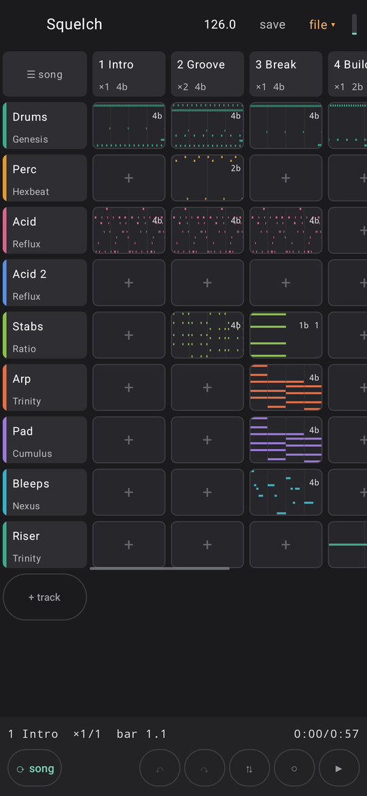
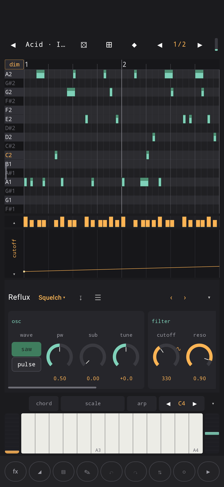
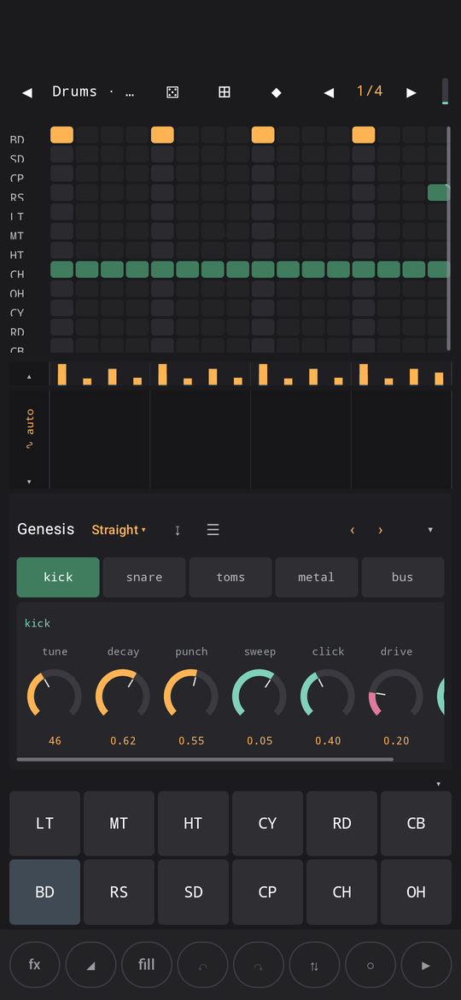
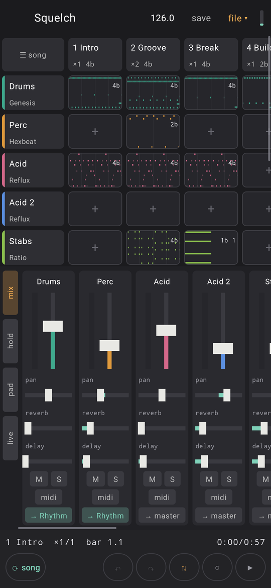
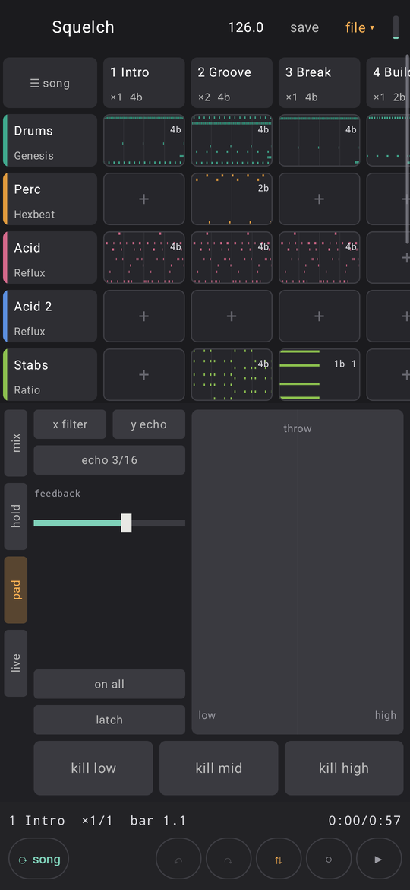
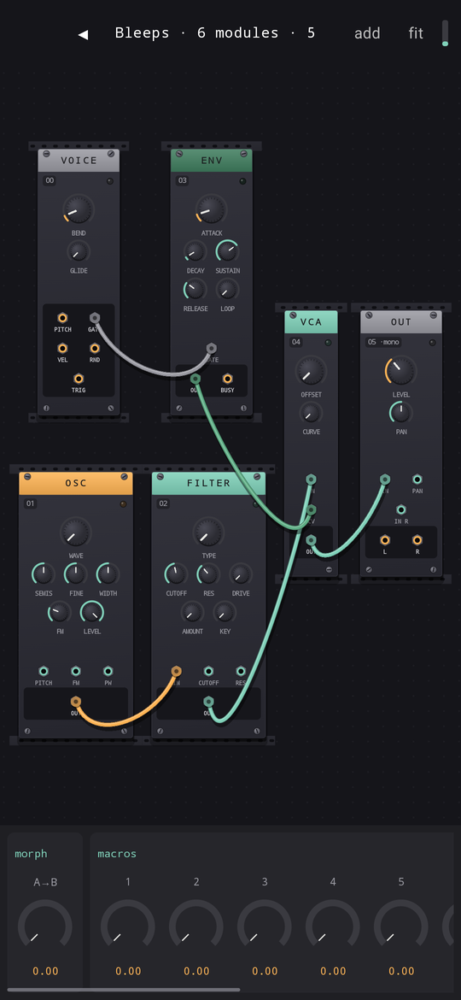

# Acidulous

Acidulous is a music studio for Android 8.1 and up. 
It also runs on Linux, on Windows and in a web browser.

Combine up to 16 synthesizers, drum machines, noise generators and processors together into scenes of music and play them in order or pick and choose to generate something new every time.

This is an homage to Caustic and a collection of all the good ideas I've seen and had when making music with a variety of tools over the years. Some things I liked a certain way, some things I wished were another; this is the combination of all of those ideas into something I hope is cohesive and fun to use.

Read below for more details on the machines, sequencer, and app capabilities. 

Acidulous is very near a 1.0 release which means I think it is feature ready for use and proper testing by people other than myself.
You can very much make music with this now, sequencing and recording, playing and performing. You can record and alter your voice, other instruments, other synths and drum machines. You can export via a number of formats, in full form or split into stems.

Please do all of these things and then let me know what works, what doesn't work, what could work in the future so I can grow it into something even more interesting.

And please join me in the #acidulous channel **[on my discord](https://discord.gg/9Wun47jGC6)**  to share comments, ask questions, report bugs or issues with different devices, or to request new features. Or feel free to open an issue here.

The manual is in [manual/](manual/) and in the app in the **Help…** window.

Disclaimer: I am not a great programmer and this was made using Claude Opus 5.0/5.5

Enjoy,<br>
Dan (rm)

---

## Screenshots

<table>
  <tr>
    <td align="center"><br>The song: tracks down, scenes across</td>
    <td align="center"><br>An acid line, with its filter drawn in</td>
    <td align="center"><br>Drums: steps, pads and the kit's knobs</td>
  </tr>
  <tr>
    <td align="center"><br>The mixer, with a drum group</td>
    <td align="center"><br>The perform pad: filter, echo and kills</td>
    <td align="center"><br>The modular, patched by hand</td>
  </tr>
</table>

All six are the demo song, Squelch.

---

## What's in it

### Twenty-two machines

| | |
|---|---|
| **Reflux** | Acid bass. One oscillator and a filter that screams. Play harder for accent and overlap notes to slide. |
| **Trinity** | A three-oscillator poly synth with wavetables, stacked voices, FM between the oscillators and some drift. |
| **Ratio** | Six-operator FM. Morph between two algorithms, and snap or skew the operator ratios. |
| **Manual** | An organ with two manuals and pedals, four models (tonewheel, combo, reed, pipe) and a rotary cabinet. |
| **Cumulus** | Big, smooth pads built from a spectrum of partials. |
| **Formulate** | An 8-bit chip synth with tracker-style tables, and you can type in your own waveform as a formula. |
| **Filament** | Modelled strings you can pluck, pick, hammer, bow or blow. |
| **Brazen** | Modelled brass, from tuba to trumpet, or a section of four players. |
| **Timber** | Modelled woodwinds: clarinet, oboe, sax, flute and friends. |
| **Resonance** | Eight struck objects (drums, wood, metal, bells) that ring into each other. |
| **Hammer** | Modelled pianos and their relatives: grands, uprights, electric pianos, celesta, toy piano, dulcimer and cimbalom. |
| **Hexbeat** | A synthesized drum machine in the style of the classic small boxes, with thirteen voices. |
| **Genesis** | The big drum box: a heavy kick, some circuit drift and a bus compressor the kick ducks. |
| **Mosaic** | A multisample player for SoundFonts or your own samples, which can also turn them into grain clouds. |
| **Pollen** | Granular clouds from a file or from the live input. |
| **Dice** | A loop slicer that keeps a loop at the song's tempo, and can shuffle, stutter, reverse and drop slices by chance. |
| **Forage** | A sample drum machine with thirteen pads for your own sounds. |
| **Cipher** | A vocoder where you can rearrange which bands drive which. |
| **Molt** | Sing a take and play it back tuned to the notes you draw. |
| **Diction** | A vocal synthesizer trained on your voice and taken to the next level. |
| **Nexus** | A modular synth whose modules are the other machines. |
| **Bias** | A four-track for audio recordings that runs along the song. |

### Sixteen effects

Each has the usual controls plus one extra, and its own page in the manual.

| | |
|---|---|
| **Delay** | Echoes on a note value, and it can duck while you play. |
| **Reverb** | A room that can also freeze, gate, shimmer up an octave or crush itself down to 8 bits. |
| **Eq** | Three bands and a tilt. |
| **Filter** | Low, band or high pass, moved by an LFO, the signal's level or another track. |
| **Width** | Wider, narrower, mono below a frequency or rotated. |
| **Distortion** | Four kinds of clipping and a bias control. |
| **Amp** | A guitar amp with a cabinet you can resize from a small combo to a full stack. |
| **Bitcrusher** | Fewer bits, a lower sample rate and an unsteady clock if you want one. |
| **Compressor** | The usual controls, a sidechain from any track and a pump that follows the tempo. |
| **Gate** | A noise gate that another track can open. |
| **Chorus** | Two to four detuned voices that drift. |
| **Flanger** | A short sweeping delay, with negative feedback for the hollow sound. |
| **Phaser** | Two to eight stages. |
| **Tremolo** | Volume on an LFO, or auto-pan. |
| **Shifter** | Frequency shifting, for metallic and detuned sounds. |
| **Harmonizer** | Adds two voices at scale steps, so they stay in key. |

### Mixing

- Two insert effects on every track, and two on the master before the limiter.
- Two send buses for the whole song. They start as a reverb and a delay but can hold any effect.
- Up to four groups in the mixer, to put tracks through the same effects and fader.
- Sidechains: the compressor, gate and filter can follow another track, like ducking the bass under the kick.
- A loudness meter (LUFS and true peak) on the master, and exports can be normalised to -14 LUFS.
- Three perform pages beside the mixer for playing a song live. Hold has beat repeat, gate, reverse, tape stop and a riser. Pad has an XY pad and kill switches. Live has mutes that wait for the bar, and fill. They work on the whole mix or one group, and they record into the song.

### Sequencing

- Songs are made of scenes. Clips in a scene can be different lengths, and scenes can repeat, change tempo or speed up and slow down.
- The same song as a clip launcher for playing live, where any empty cell is a looper.
- Piano roll and drum grid.
- Scale, chord and arp that act on notes as you play them in.
- Swing and tunings per song, with per-track overrides. Just, meantone and others are built in, or bring your own Scala files.
- Transpose a track, give it a fixed velocity or its own colour by holding its name.
- Automation, mod wheel and pressure lanes, and per-note pitch bend, pressure and slide.
- Probability, conditions, ratchets and micro-timing on single notes.
- Pattern generators for even rhythms, lines in key and mutating what's there.
- Step locks, so a knob can have its own value on chosen steps.
- Freeze a clip to audio to save CPU.
- Audio tracks (Bias) for recording over the song. A loop added to one follows the song's tempo.
- Two effect slots on the input, so you can record through an amp.

### Playing and syncing

- MIDI in over USB and Bluetooth LE, and MIDI out with clock.
- Sustain, sostenuto and soft pedals, recorded as lanes.
- MPE.
- Ableton Link, and MIDI clock in and out.
- Map any MIDI CC or note to any control.
- Built in, USB or Bluetooth keyboards: letters play notes, every control can be used from the keys, and every screen has shortcuts you can change in Settings.

### Import and export

Export WAV, AIFF, FLAC, MP3 or AAC, as the whole song, one scene or stems, and MIDI files or a song bundle you can share.

Import MIDI files as a new song, with a machine picked for each part and General MIDI drums moved onto a drum machine. Song bundles open with their samples, and sounds go into the library.

Exports can go straight to the share sheet, and files shared to the app or opened with it get imported.

### Accessibility

Works with TalkBack. Every control says what it is and what it's set to, knobs and faders change with a swipe, and anything you'd hold is in TalkBack's actions menu. Everything can be done from a keyboard too, and there's a high contrast theme in Settings.

---

## Installing

The easiest way to install Acidulous on Android and keep it up to date is my F-Droid repo:

[https://roge-rm.gitlab.io/repo](https://roge-rm.gitlab.io/repo?fingerprint=80438B253C257BCCE05CDCB9E3AC9B6174C2250659962B14FCBE7F32FD42D53E)

Then search for Acidulous in F-Droid, and it will offer each new version as an update.

You can also download the APK from the [Releases](https://github.com/roge-rm/Acidulous/releases)
page and sideload it. There are two, the usual 64-bit one and a 32-bit one
for tablets that run 32-bit Android like the Fire HD 8.

### Linux

From the [Releases](https://github.com/roge-rm/Acidulous/releases) page:

- **Debian 13 (Trixie) and Raspberry Pi OS:** the `.deb` for your machine,
  amd64 or arm64. Install it with `sudo apt install ./acidulous_*.deb` and
  it brings Java 21 with it.
- **Anything else** (Ubuntu 22.04 and newer, Fedora, Arch, the Steam Deck):
  the AppImage, x86_64 or aarch64. It has its own Java, so just make it
  executable and run it.

### Windows

Windows 10 or 11, 64-bit. From the [Releases](https://github.com/roge-rm/Acidulous/releases)
page, run `acidulous-*-setup.exe`, or unzip `acidulous-*-windows-x64.zip`
anywhere and run `Acidulous.exe`. They aren't signed, so Windows will warn
you: choose **More info** and then **Run anyway**. If your audio interface has
its own low-latency driver, pick it in **Settings › audio › output**.

### In a browser

[https://roge-rm.gitlab.io/play/acidulous](https://roge-rm.gitlab.io/play/acidulous/)

Chrome or Edge work best, since they have MIDI. You can install it from the
address bar, and after the first visit it works offline. Your songs are kept
in the browser.

## Building

You need the Android SDK and NDK. The NDK version is set in
`app/build.gradle.kts`.

```sh
./gradlew assembleDebug             # debug APK
./gradlew testDebugUnitTest         # unit tests
./gradlew -Parm32 assembleRelease   # the 32-bit APK
```

The desktop and browser versions build from the same code, on Linux. The
packages need Docker, and the browser's engine needs the Emscripten SDK.

```sh
./gradlew :desktop:run                          # run it on this computer
./gradlew :desktop:debAmd64 :desktop:debArm64   # the Debian packages
./gradlew :desktop:appImageAmd64                # an AppImage (appImageArm64 too)
./gradlew :desktop:windowsX64                   # the Windows installer and zip
./gradlew :webApp:wasmJsBrowserDistribution     # the browser version
```

| | |
|---|---|
| Minimum Android | 8.1 (API 27) |
| Built against | API 37 |
| ABIs | `arm64-v8a`, `x86_64`; with `-Parm32`, `armeabi-v7a` and `x86` |
| UI | Kotlin, Compose |
| Engine | C++17 in `app/src/main/cpp`, with audio through Oboe on Android, miniaudio on the desktop and Web Audio in a browser |

## Testing

The engine tests run on the computer and take a few minutes:

```sh
tools/all_tests.sh
```

They check things like:

- every machine sounds the same after a panic as before it (`reset_test`)
- a song renders the same twice, sidechains and groups work, and exports ignore the lean quality setting (`render_test`)
- every modulation source and destination in every machine does something (`modsource_test`)
- every factory patch makes a sound without clipping, and no two patches in a bank are the same (`bank_test`)
- the loudness meter reads the EBU's test signals correctly (`loudness_test`)

`tools/cpu_test.sh` measures what each machine and effect costs.

### Auditioning patches

`tools/audition.sh` plays a factory patch, writes a WAV and prints some
measurements (loudness, peak, brightness, attack and ring time). I use it
along with my ears when voicing the preset banks.

```sh
tools/audition.sh bank Trinity            # every patch in a bank
tools/audition.sh play Reflux Squelch     # one patch
tools/audition.sh params Mosaic           # the parameter table
```

---

## Licence

Acidulous is free software under the **GNU General Public License, version 3
or later**. See [LICENSE](LICENSE).

Copyright © 2026 Dan Hunke.

The third-party parts (Oboe, LAME, Ableton Link, asio, miniaudio, alsa-lib,
Steinberg's driver SDK and subsets of the DejaVu and Noto fonts) are listed
with their licences in [NOTICE](NOTICE), and you can read every licence in the
app's About window.

Everything else, including the engine, the machines and effects, the
sequencer and the file writers, was written for this project. No DSP code,
presets or samples come from anywhere else.
