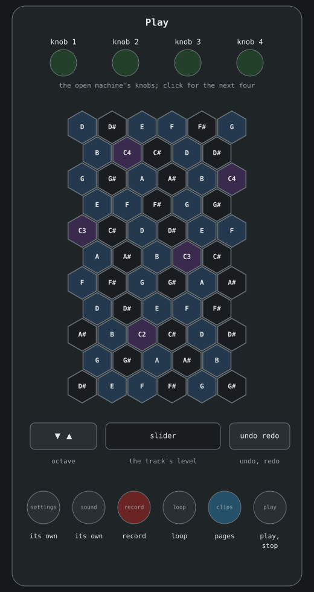
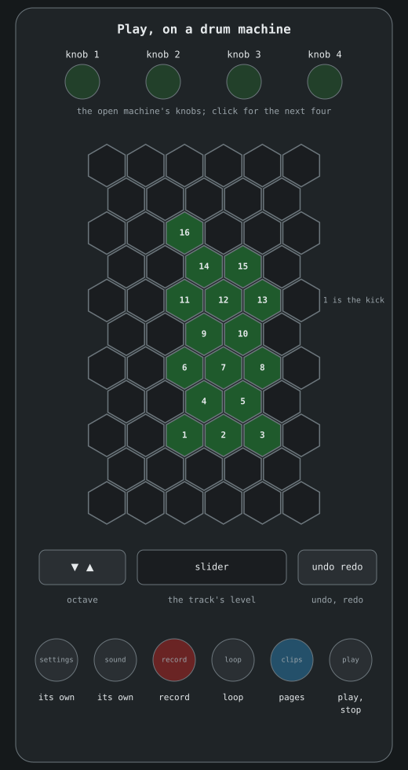
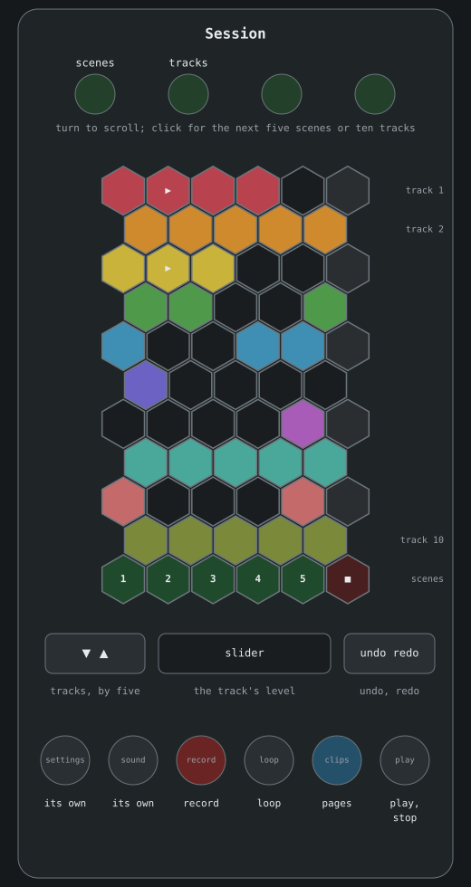
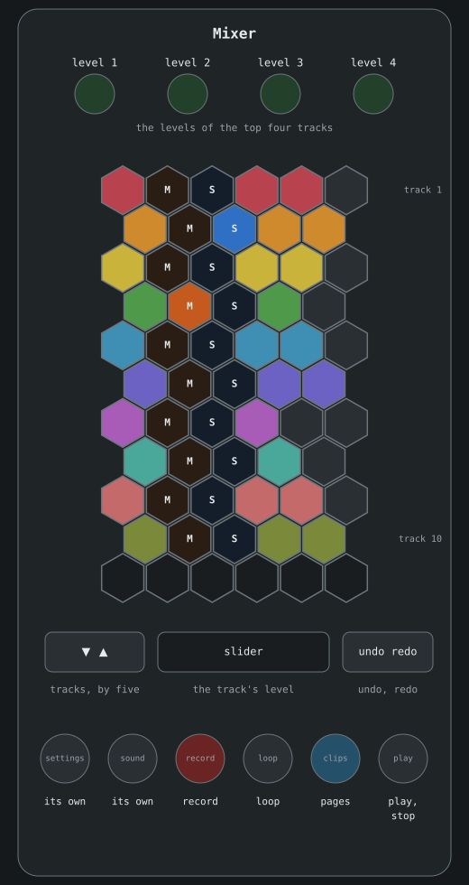
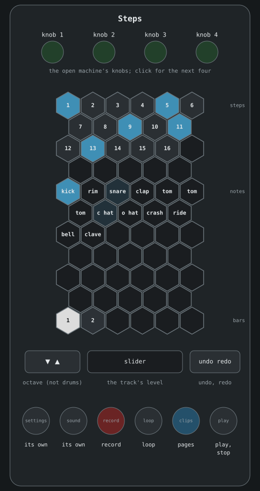

# Exquis
> The Exquis by Intuitive Instruments as a controller: its own playing, and the song, the mixer and steps on its pads.

Plug in an Exquis over USB and Acidulous plays it as a controller, held upright
with its knobs at the top. It needs the Exquis firmware 2.1 or newer. **exquis**
in the MIDI window's devices tab gives it back, and closing the app does too.

Its **settings** and **sound** buttons stay its own, so its menus are there as
usual, like switching MPE on or off.

There are four pages, and the colour of **clips** shows which one: grey for
Play, green for Session, orange for Mixer and blue for Steps. Tap **clips** to
go between Play and the page you used last. Hold it and the pads in the middle
show the four pages in their colours: tap one to go there.

Set **exquis pages** to **notes only** to keep it on Play, for playing live
while you change scenes and clips on the screen.

On every page:

- **record**, **loop** and **play** arm recording, loop the scene, and start and
  stop the song. **undo** and **redo** do what they say. Their lights follow the
  app.
- The **slider** moves the played track's level as you slide along it, and its
  lights show the level.
- The **knobs** are the open machine's knobs, four at a time. Click one for the
  next four. Session and Mixer use them differently, below.

## Play

The pads are the Exquis's own, with its velocity, pressure and MPE. The arrows
move the notes up or down an octave, and the one you've moved towards is lit.
The app does the octave rather than the Exquis, so the Exquis stays at its own,
and changing its octave in its own menus moves everything off. Its pads show the scale of the track it
plays: the track's own Scale modifier if it has one or the song's key if not,
the same as the piano roll. With **pinned** it's the pinned track, and with
**by channel** it's the track for the channel the Exquis plays on. MPE fingers
aren't routed by channel, so with MPE it's the open track or the pinned one.

**exquis pads** in the devices tab chooses how the scale shows:

- **own colours** sets the Exquis's own tonic and scale, so the pads show it in
  the colours you gave them. While Acidulous has the Exquis it gets the exact
  scale. With **exquis** set to **its own**, a scale the Exquis doesn't have
  shows as the nearest one that has all its notes, or chromatic.
- **highlight** lights the notes in the Exquis's highlight green instead, one
  pad per note, over whatever scale the Exquis is set to.
- **off** leaves the pads alone.

On a drum machine the middle of the pads are its drums instead, lit in green,
the kick lowest and the rest in the order the app shows its pads. Most notes are
on two pads, so most drums are too, and the Exquis lights one of them. The
other pads play nothing.

## Session

The song grid, a row for each track with the first at the top, and a pad for
each of five scenes across. A clip pulses while it plays and flashes while it
waits. Tap a clip to launch it in clip mode, or to play from that scene in song
mode.

The bottom row is the scenes: tap one to play it. Its sixth pad stops the clips,
or the song. The arrows move through the tracks five at a time.

With more scenes than fit, knob 1 is lit brighter and the last pad of every
other row glows faintly while there are more to the right. Turn knob 1 to move
through the scenes one at a time, or click it for the next five, back to the
start after the last. Knob 2 does the same for the tracks, ten at a time.

## Mixer

A row for each track. The first pad chooses the track the Exquis plays, and is
bright on that one. **M** mutes and **S** solos. The pads after them are its
level: tap one to set the level there, and tap the top lit one again to bring it
down a step. The knobs are the levels of the four tracks at the top, and the
arrows move through the tracks five at a time.

## Steps

The open track's clip in the current scene, sixteen steps at a time on the three
rows at the top. Under them are the notes: a drum machine's drums, or the scale
up from the octave. Tap one to choose the note the steps write, and it plays so
you can hear it.

A step lit in the track's colour has that note. Tap a step to add it or take it
away, and the step playing is white. The bottom row is the clip's bars of
sixteen steps: tap one to see it. The arrows change the octave of the notes,
except on a drum machine.

Off the Play page the pads say only pressed or not, so steps are written at one
velocity.
