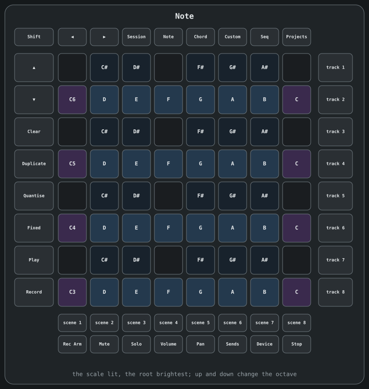
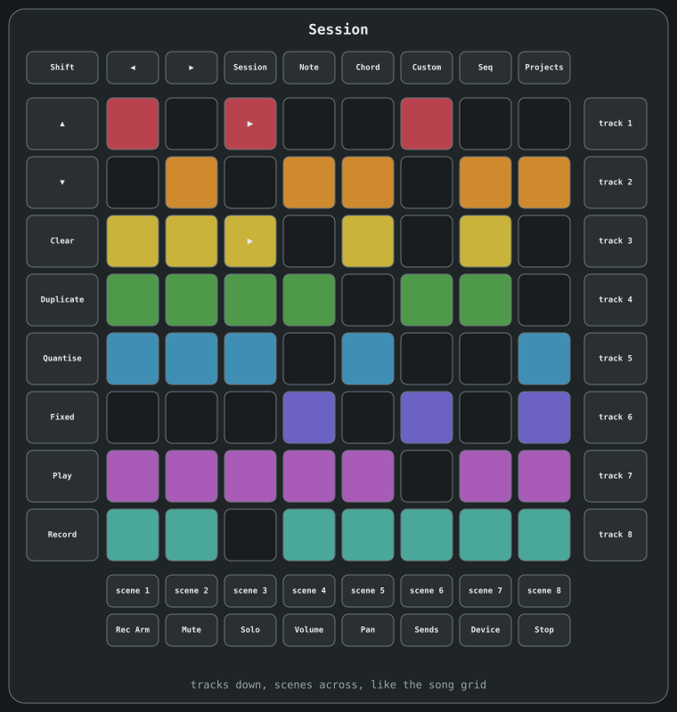

# Launchpad Pro
> The Novation Launchpad Pro [MK3] as a controller: notes, the song grid, steps, the mixer, chords and the perform effects.

Plug in a Launchpad Pro [MK3] over USB and Acidulous takes over every pad and
button, lit in your tracks' colours. **launchpad** in the MIDI window's devices
tab gives it back, and so does closing the app.

The buttons along the top choose what the grid is:

- **Note** - a piano keyboard like the one on screen, with white keys on one row
  and black keys on the row above, four octaves up the grid. The notes in the
  scale (the track's own, or the song's key) are lit in the track's colour with
  the root brightest, and the rest are faint but still play. When the track has
  its own **Scale** modifier on, only the scale's notes are there, an octave a
  row from the root, which fits eight octaves. On a drum machine it's the
  machine's pads, laid out like on screen. Up and down change the octave.
- **Session** - the song grid, laid out like on screen with tracks down and
  scenes across. A clip pulses while it plays and flashes while it waits. Tap a
  clip to launch it in clip mode, or to play from that scene in song mode.
- **Sequencer** - the open track's clip in the current scene, eight steps at a
  time. Tap a pad to add or remove a note. Left and right move a step at a time,
  and up and down move through the notes. A drum machine's rows run down from
  the kick, like its grid on screen.
- **Custom** - the mixer, laid out like the song grid, with a row for each track
  and its fader running left to right. **Volume**, **Pan** and **Sends** on the
  bottom row choose what the faders are, and **Device** makes the rows the
  played machine's first eight knobs.
- **Chord** - chords in the key, a column for each note of the scale and a row
  for each kind of chord.
- **Projects** - the perform effects: repeat and gate along the top, reverse,
  tape stop, the riser, the three kills and an XY pad. Hold to play.

The buttons round the edge work on every page:

- **Play** and **Record** do what they say. **Shift** and **Play** stops
  everything.
- **Shift** and **Clear** undoes, and **Shift** and **Duplicate** redoes.
- Hold **Clear** and tap a clip to clear it. Hold **Duplicate** and tap a clip to
  copy it into the next scene if that's empty, or tap a scene button to
  duplicate the scene.
- The buttons down the right are the tracks, top to bottom like the grid's rows.
  Tap one to choose the track the Launchpad plays. Hold **Mute** or **Solo** and
  tap one to mute or solo it.
- The row under the grid is the scenes, left to right. Tap one to play it, like
  tapping a scene's header.
- On **Session** and **Custom**, up and down move through the tracks and left and
  right through the scenes, one at a time. On the other pages, hold **Shift** to
  do the same. An arrow is lit when there's more that way.
- **Quantise** quantises the open clip the way the quantise window was last set.
- **Stop Clip** stops the clips, or the song.

Its pads send velocity and pressure, and both are recorded like any keyboard.

Set **launchpad pages** in the devices tab to **notes only** to keep it on
**Note**, for playing live while you change scenes and clips on the screen. The
other page buttons then do nothing.
